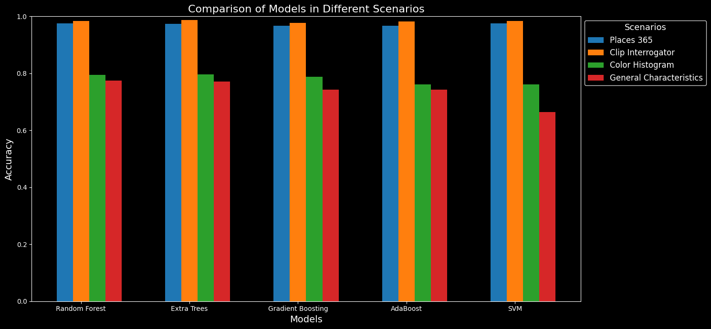

# Image Classification Comparison
A set of codes with the goal of classifying images of mountains and beaches using multiple techniques and comparing them.

# Dataset
The dataset consists of 1076 images of mountains and beaches, they were bulk downloaded using [this](https://github.com/ostrolucky/Bulk-Bing-Image-downloader) repository.

# Requirements
  - wget
  - Python 3.9
  - CUDA (Optional)
  - CUDNN (Optional)

  The libraries can be installed using the following command:
  ```bash
  pip install -r requirements.txt
  ```

# Codes
  - Places365: This notebook is used to classify the images using the [Places365](https://github.com/CSAILVision/places365) model, the model is used to get the top n descriptors for each image, then TF-IDF is used to get the vector representation of the descriptors. The vector representation is then used to classify the images.
  - Color Histogram: This notebook is used to classify the images using the color histogram, the histogram is calculated for each image and then the image is classified using the histogram.
  - General Characteristics: This notebook is used to classify the images using the general characteristics, the general characteristics are calculated for each image and then the image is classified using the general characteristics.
  - Clip Interrogator: This notebook is used to classify the images using the [Clip Interrogator](https://github.com/pharmapsychotic/clip-interrogator) model, the model is used to get a natural description for each image, then TF-IDF is used to get the vector representation of the descriptors.

# Benchmark
The following models were used to classify the images:
  - Random Forest
  - Extra Trees
  - Gradient Boosting
  - AdaBoost
  - SVM

The metric "**accuracy**" was used to evaluate the models.

## Results

The best model is Extra Trees using the Clip Interrogator method with **98.69%** of accuracy.

| Model              | Places 365 | Clip Interrogator | Color Histogram | General Characteristics |
|--------------------|------------|-------------------|-----------------|-------------------------|
| Random Forest      | 97.58%     | 98.42%            | 79.46%          | 77.51%                  |
| Extra Trees        | 97.39%     | 98.69%            | 79.64%          | 77.13%                  |
| Gradient Boosting  | 96.65%     | 97.76%            | 78.81%          | 74.32%                  |
| AdaBoost           | 96.74%     | 98.23%            | 76.11%          | 74.35%                  |
| SVM                | 97.58%     | 98.42%            | 76.11%          | 66.36%                  |

_<small>The metric is accuracy</small>_


# Mutual Information
As a extra piece of information, the mutual information was obtained for Places 365 and Clip Interrogator.

The beast word to classify the images is:
- Places 365: **coast**
- Clip Interrogator: **beach**

# License
This project is licensed under the MIT License